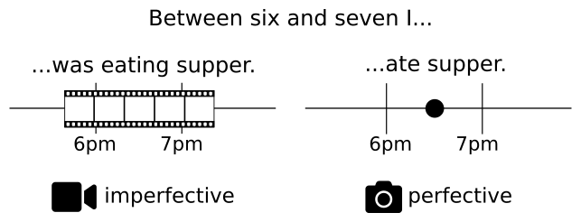
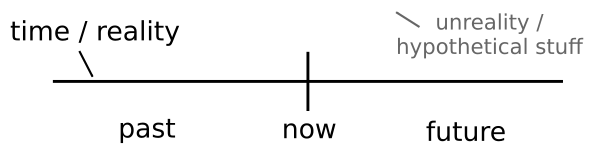
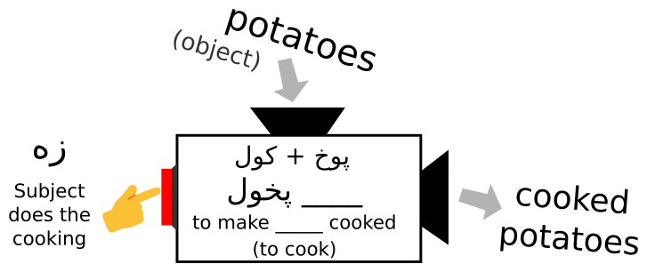
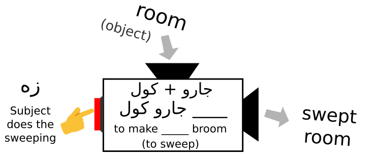
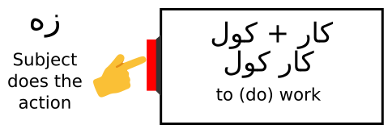

import TensesChart from "../../../src/components/tenses-chart/TensesChart";
import Example from "../../../src/components/example/Example";
import {
    getVerbInfo,
    RootsAndStems,
    defaultTextOptions,
} from "@lingdocs/new-inflector";
export const CardRow = (props) => (
  

    {props.children}
  

);

export function VerbDemo(props) {
    return (
        

            <h5>{props.v.p} - {props.v.f} ({props.v.e})</h5>
            

                
🌳 Stems and Roots

                <RootsAndStems
                    info={getVerbInfo(props.entry, props.complement)}
                    textOptions={defaultTextOptions}
                />
            

            

                
Example conjugations

                {props.children}
            

        

    );
}

Pashto verbs may seem confusing, unruly, and intimidating to the outside learner. But in reality, once we get to know them, we see that they all follow one beautiful, simple structure. If we can understand this [basic set of rules](#the-master-formula-for-pashto-verbs), all verbs will make perfect sense.

Over the course of this post we'll do three things:

1. Introduce the idea of [the two aspects in Pashto verbs](#two-aspects-in-pashto-verbs)
2. Give you the [simple master formula](#the-master-formula-for-pashto-verbs) for all verbs
3. [Prove](#how-this-actually-works-for-all-verbs) how this does work for *all* verbs 

## Two Aspects in Pashto Verbs

The first thing to realize in that in Pashto, **every verb has two main roots**, based on two different [aspects](https://en.wikipedia.org/wiki/Grammatical_aspect).

In Pashto, all verbs are divided up into two different [aspects](https://en.wikipedia.org/wiki/Grammatical_aspect): imperfective and perfective. **We can think of the aspect as our *angle* or *perspective* on the action**. Do we see the action from inside, as something ongoing or recurring? That's the imperfective aspect. Do we see the action as a whole snapshot, completed and done? That's the perfective aspect.

It might help to think of these two aspects as *videos* and *photos* of some event. When you see a video <i className="fas fa-video" />, you can see the action happening over time. You can be immersed in it. You can see the inner workings of an action as it's ongoing or repeated. When you see a photo <i className="fas fa-camera" />, you see the action from the outside, as a whole. You just know that it happened, that's all.

With the <i className="fas fa-video" /> *imperfective aspect*, we can see that an action progresses over time, or is repeated.

import imperfInTime from "./imperfective-time.svg";

With the <i className="fas fa-camera" /> *perfective aspect*, we only see that an action *happens*. We just see it as simple event. All we know is that the action occurs.

In English we often use these two different aspects with the past tense:

For an excellent explanation of these aspects from a different perspective, see [this video on how aspects are used in Maya](https://youtu.be/ttq0S4cuIHA?t=228).

In Pashto we also use these aspects not just for the past tense, but in all kinds of other ways as well. For example, in English we can only say "Eat palaaw!" but in Pashto you can have two very different kinds of commands, depending on the aspect that you use.

<table class="table" style={{ tableLayout: "fixed" }}>
  <thead>
    <tr>
      <th scope="col"><i className="fas fa-video fa-lg" /> Imperfective Imperative</th>
      <th scope="col"><i className="fas fa-camera fa-lg" /> Perfective Imperative</th>
    </tr>
  </thead>
  <tbody>
    <tr>
      <td>پلاو خوره! / paláaw khorá!</td>
      <td>پلاو وخوره! / paláaw óokhora!</td>
    </tr>
    <tr>
      <td>Eat palaaw!</td>
      <td>Eat palaaw!</td>
    </tr>
    <tr>
      <td><strong>ongoing</strong></td>
      <td><strong>one time</strong></td>
    </tr>
    <tr>
      <td><em>You should make a habit of eating it, repeatedly or generally</em></td>
      <td><em>I'm just telling you to do this one time.</em></td>
    </tr>
  </tbody>
</table>

If we set up a little graph of reality like this...

...then we can draw some rough diagrams of what all the different verb forms are used for:

import presentImg from "./present.svg";
import subjunctiveImg from "./subjunctive.svg";
import perfFutureImg from "./perfective-future.svg";
import imperfFutureImg from "./imperfective-future.svg";
import perfImperativeImg from "./perfective-imperative.svg";
import imperfImperativeImg from "./imperfective-imperative.svg";
import perfPast from "./perfective-past.svg";
import imperfPast from "./imperfective-past.svg";
import presentPerfect from "./present-perfect.svg";

<TensesChart>{[
  [
    { 
      notes: "Something that is happening, happens generally, or is definitely about to happen",
      image: presentImg,
    },
    {
      notes: "Used for hypothetical statements about the desire, necessity, purpose, or possibility of something happening. Or for saying something should or shouldn't happen",
      image: subjunctiveImg,
    },
  ],
  [
    { 
      notes: "Saying something will happen, repeatedly or as an ongoing action",
      image: imperfFutureImg, 
    },
    { 
      notes: "Saying something will happen as a one-time event - May also used when there is some doubt",
      image: perfFutureImg, 
    },    
  ],
  [
    { 
      notes: "Commanding someone/people to do something repeatedly, or in general",
      image: imperfImperativeImg, 
    },
    { 
      notes: "Commanding someone/people to do something one time",
      image: perfImperativeImg, 
    },
  ],
  [
    { 
      notes: "Saying something was happening, or would happen",
      image: imperfPast, 
    },
    { 
      notes: "Saying something happened.",
      image: perfPast, 
    },  
  ],
  [
    {
      notes: "Saying something happened and it affects the present",
      image: presentPerfect,
    }
  ]
]}</TensesChart>

That's nice, but when we speak Pashto, how do we actually make these different forms? What do we do to the verbs to make them fit into these different boxes?

Below is *one simple formula for every different form*. This is the **master chart** you came for. First have a look, and then we'll see how this actually works with different verbs.

## The Master Formula for Pashto Verbs

export const verbFormula = [
  [
    <>imperfective stem + present ending</>,
    <>perfective stem + present ending</>,
  ],
  [
    <>به + present</>,
    <>به + subjunctive</>,
  ],
  [
    <>imperfective stem + imperative ending</>,
    <>perfective stem + imperative ending</>, 
  ],
  [
    <>imperfective root + past ending</>,
    <>perfective root + past ending</>,
  ],
  [
    <>past participle + equative verb</>
  ],
]; 

<TensesChart formula={verbFormula} />

Behold the simplicity. All verbs follow this chart exactly. Yes, all of them. Exactly. 

A little fine print/clarification:

- With transitive past tense verbs, the endings will agree with the object, not the subject.
- With negative imperative statements, only the imperfective form is used.

## How this actually works for all verbs

Now let's see how we can use this formula to make the forms of *any kind of verb we want*. Whatever verb we encounter, it will always follow these very simple rules. We just need to explain what these "stems" and "roots" that we mentioned are.

#### Regular Verbs

Here's how you make the ingredients mentioned with regular verbs:

**Imperfective root:** That's just the infinitive, the base form of the verb. It can come in either a short or long form, with or without the ل on the end.

**Imperfective stem:** This is just the shorter form of the imperfective root, without the ل on the end.

**Perfective root:** To make the perfective root, you do two things:

 1. Add a و - oo prefix on the front
 2. Shift the accent/emphasis to the front

**Perfective stem:** This is just the short form of the perfective root.
 

So let't try that with the regular verbs لیکل - leekúl and وهل - wahúl...

<VerbDemo
    v={{ p: "لیکل", f: "leekul", e: "to write" }}
    entry={{"i":11207,"ts":1527812856,"p":"لیکل","f":"leekul","e":"to write","c":"v. trans."}}
>
    <TensesChart formula={verbFormula}>{[
        [
            {
              ex: { p: "هغه لیکي", f: "hagha leekée", e: "She writes" },
            },
            {
              ex: { p: "هغه ولیکي", f: "hagha óoleekee", e: "...so she'll write" },
            },
        ],
        [
            {
              ex: { p: "هغه به لیکي", f: "hagha ba leekée", e: "She will write" },
            },
            {
              ex: { p: "هغه به ولیکي", f: "hagha ba óoleekee", e: "She will write" },
            },
        ],
        [
            {
              ex: { p: "لیکه!", f: "leeká!", e: "Write!" },
            },
            {
              ex: { p: "ولیکه!", f: "óoleeka!", e: "Write!" },
            },
        ],
        [
            {
              ex: {
                  long: { p: "هغې کیسه لیکله", f: "haghé keesa leekúla" },
                  short: { p: "هغې کیسه لیکه", f: "haghé keesa leeká" },
                  e: "She was writing a story",
                },
            },
            {
              ex: {
                long: { p: "هغې کیسه ولیکله", f: "haghé keesa óoleekula" },
                short: { p: "هغې کیسه ولیکه", f: "haghé keesa óoleeka" },
                e: "She wrote a story"
              },
            },
        ],
        [
            {
              ex: { 
                  p: "هغې کیسه لیکلې ده",
                  f: "haghé keesa leekule da",
                  e: "She's written a story",
                },
            },
        ],
    ]}</TensesChart>
</VerbDemo>

<VerbDemo
    v={{ p: "وهل", f: "wahul", e: "to hit"}}
    entry={{"i":13941,"ts":1527815399,"p":"وهل","f":"wahul","e":"to hit","c":"v. trans.","tppp":"واهه","tppf":"waahu"}}
>
    <TensesChart formula={verbFormula}>{[
        [
            {
                ex: { p: "هغه وهي", f: "hagha wahée", e: "She hits" },
            },
            {
                ex: { p: "هغه ووهي", f: "hagha óowahee", e: "...so She'll hit" },
            },
        ],
        [
            {
                ex: { p: "هغه به وهي", f: "hagha ba wahée", e: "She will hit" },
            },
            {
                ex: { p: "هغه به ووهي", f: "hagha ba óowahee", e: "She will hit" },
            },
        ],
        [
            {
                ex: { p: "وهه!", f: "wahá!", e: "hit!" },
            },
            {
                ex: { p: "ووهه!", f: "óowaha!", e: "hit!" },
            },
        ],
        [
            {
                ex: {
                    long: { p: "هغې زه وهلم", f: "haghé zu wahúlum" },
                    short: { p: "هغې زه وهم", f: "haghé ze wahúm" },
                    e: "She was hitting me",
                },
            },
            {
                ex: {
                    long: { p: "هغې زه ووهلم", f: "haghé zu óowahulum" },
                    short: { p: "ما زه ووهم", f: "haghé ze óowahum" },
                    e: "She was hitting me",
                },
            },
        ],
        [
            {
                ex: { 
                    p: "هغې زه وهلی یم",
                    f: "haghé zu wahuley yum",
                    e: "She's hit me (male).",
                },
            },
        ],
    ]}</TensesChart>
</VerbDemo>

#### Verbs with irregular stems

Other verbs have a *special form in the present tense (imperfective stem)*. To make the perfective stem we just add a **"و - oo/w" prefix** on the front of this irregular stem form.

Here are a couple examples of verbs where the present / stem forms are irregular: 

<VerbDemo
    v={{p: "لیدل", f: "leedul", e: "to see"}}
    entry={{"i":11186,"ts":1527812275,"p":"لیدل","f":"leedul","e":"to see","c":"v. trans.","psp":"وین","psf":"ween"}}
>
    <TensesChart formula={verbFormula}>{[
        [
            {
                ex: { p: "زه وینم", f: "zu weenum", e: "I see" },
            },
            {
                ex: { p: "زه ووینم", f: "zu óoweenum", e: "...so I'll see" },
            },
        ],
        [
            {
                ex: { p: "زه به وینم", f: "zu ba weenum", e: "I will see" },
            },
            {
                ex: { p: "زه به ووینم", f: "zu ba óoweenum", e: "I will see" },
            },
        ],
        [
            {
                ex: { p: "وینه!", f: "weena!", e: "see!" },
            },
            {
                ex: { p: "ووینه!", f: "óoweena!", e: "see!" },
            },
        ],
        [
            {
                ex: {
                    long: { p: "هغې زه لیدلم", f: "haghé zu ledúlum" },
                    short: { p: "هغې زه لیدم", f: "haghé zu ledúm" },
                    e: "She would see me",
                },
            },
            {
                ex: {
                    long: { p: "هغې زه ولیدلم", f: "haghé zu óoledulum" },
                    short: { p: "هغې زه ولیدم", f: "haghé zu óoledum" },
                    e: "She saw me",
                },
            },
        ],
        [
            {
                ex: { 
                    p: "هغې زه لیدلی یم",
                    f: "haghé zu ledúley yum.",
                    e: "She has seen me (male).",
                },
            },
        ],
    ]}</TensesChart>
</VerbDemo>

<VerbDemo
    v={{ p: "خوړل", f: "khoRul", e: "to eat" }}
    entry={{"i":5597,"ts":1527812790,"p":"خوړل","f":"khoRul","e":"to eat, to bite","c":"v. trans.","psp":"خور","psf":"khor","tppp":"خوړ","tppf":"khoR"}}
>
    <TensesChart formula={verbFormula}>{[
        [
            {
                ex: { p: "زه خورم", f: "zu khorúm", e: "I eat" },
            },
            {
                ex: { p: "زه وخورم", f: "zu óokhorum", e: "...so I'll eat" },
            },
        ],
        [
            {
                ex: { p: "زه به خورم", f: "zu ba khorúm", e: "I will eat" },
            },
            {
                ex: { p: "زه به وخورم", f: "zu ba óokhorum", e: "I will eat" },
            },
        ],
        [
            {
                ex: { p: "خوره!", f: "khorá!", e: "eat!" },
            },
            {
                ex: { p: "وخوره!", f: "óokhora!", e: "eat!" },
            },
        ],
        [
            {
                ex: {
                    long: { p: "هغې زه خوړله", f: "maa DoDúy khoRúla" },
                    short: { p: "هغې زه خوړه", f: "maa DoDúy khoRá" },
                    e: "I was eating food",
                },
            },
            {
                ex: {
                    long: { p: "هغې زه وخوړله", f: "maa DoDúy óokhoRula" },
                    short: { p: "هغې زه وخوړه", f: "maa DoDúy óokhoRa" },
                    e: "I ate food",
                },
            },
        ],
        [
            {
                ex: { 
                    p: "ما ډوډۍ خوړلې ده",
                    f: "maa DoDúy khoRúle da",
                    e: "I have eaten food (I'm full now)",
                },
            },
        ],
    ]}</TensesChart>
</VerbDemo>

#### Regular intransitive verbs

For intransitive verbs that end in ېدل - edul, the imperfective stem changes from ېدل - edul to ېږـ  - eG-.

<VerbDemo
    v={{ p: "غږېدل", f: "ghuGedul", e: "to speak" }}
    entry={{"i":8892,"ts":1527813680,"p":"غږېدل","f":"ghuGedul, ghaGedul","e":"to converse, speak, talk, sing","c":"v. intrans."}}
>
    <TensesChart formula={verbFormula}>{[
        [
            {
                ex: { p: "زه غږېږم", f: "zu ghuGéGum", e: "I'm speaking" },
            },
            {
                ex: { p: "زه وغږېږم", f: "zu óoghuGeGum", e: "...so I'll speak" },
            },
        ],
        [
            {
                ex: { p: "زه به غږېږم", f: "zu ba ghuGéGum", e: "I will speak" },
            },
            {
                ex: { p: "زه به وغږېږم", f: "zu ba óoghuGeGum", e: "I will speak" },
            },
        ],
        [
            {
                ex: { p: "غږېږه!", f: "ghuGéGa!", e: "speak!" },
            },
            {
                ex: { p: "وغږېږه!", f: "óoghuGeGa!", e: "speak!" },
            },
        ],
        [
            {
                ex: {
                    long: { p: "زه غږېدلم", f: "zu ghuGedúlum" },
                    short: { p: "زه غږېدم", f: "zu ghuGedúm" },
                    e: "I was speaking",
                },
            },
            {
                ex: {
                    long: { p: "زه وغږېدلم", f: "zu óoghuGedulum" },
                    short: { p: "زه وغږېدم", f: "zu óoghuGedum" },
                    e: "I spoke",
                },
            },
        ],
        [
            {
                ex: { 
                    p: "زه غږېدلی یم",
                    f: "zu ghuGedúley yum.",
                    e: "I (male) have spoken.",
                },
            },
        ],
    ]}</TensesChart>
</VerbDemo>

<VerbDemo
    v={{ p: "وېرېدل", f: "weredul", e: "to be afraid" }}
    entry={{"i":13978,"ts":1527823019,"p":"وېرېدل","f":"weredúl","e":"to be afraid, scared, to fear","c":"v. intrans."}}
>
    <TensesChart formula={verbFormula}>{[
        [
            {
                ex: { p: "زه وېرېږم", f: "zu weréGum", e: "I'm afraid" },
            },
            {
                ex: { p: "زه ووېرېږم", f: "zu óowereGum", e: "...so I'll be afraid" },
            },
        ],
        [
            {
                ex: { p: "زه به وېرېږم", f: "zu ba weréGum", e: "I will be afraid" },
            },
            {
                ex: { p: "زه به ووېرېږم", f: "zu ba óowereGum", e: "I will be afraid" },
            },
        ],
        [
            {
                ex: { p: "وېرېږه!", f: "weréGa!", e: "fear!" },
            },
            {
                ex: { p: "ووېرېږه!", f: "óowereGa!", e: "fear!" },
            },
        ],
        [
            {
                ex: {
                    long: { p: "زه وېرېدلم", f: "zu weredúlum" },
                    short: { p: "زه وېرېدم", f: "zu weredúm" },
                    e: "I was fearing / would be afraid",
                },
            },
            {
                ex: {
                    long: { p: "زه ووېرېدلم", f: "zu óoweredulum" },
                    short: { p: "زه ووېرېدم", f: "zu óoweredúm" },
                    e: "I got afraid (one moment)",
                },
            },
        ],
        [
            {
                ex: { 
                    p: "زه وېرېدلی یم",
                    f: "zu weredúley yum.",
                    e: "I (male) have become afraid.",
                },
            },
        ],
    ]}</TensesChart>
</VerbDemo>

Note: Many intransitive verbs can be said in a shorter form as well where the ېږ - eG is ommitted. For example "زه ګرځېږم" (I am walking around) or "زه ګرځم" (I am walking around - more common).
 

#### Verbs that can't take the و - oo prefix

There are many words that begin with پرې - pre, کې - ke, بو - bo etc., and these words can't take an و - oo prefix in front in the perfective aspect.

To make the perfective forms we can't:

1. <del>Add an و - oo prefix</del>

But we still have to

2. Move the accent/emphasis to the front.

<VerbDemo
    v={{ p: "کېناستل", f: "kenaastul", e: "to sit" }}
    entry={{"i":10333,"ts":1527812759,"p":"کېناستل","f":"kenaastul","e":"to sit","separationAtP":2,"separationAtF":2,"c":"v. intrans. irreg.","psp":"کېن","psf":"ken","noOo":true}}
>
    <TensesChart formula={verbFormula}>{[
        [
            {
                ex: { p: "زه کېنم", f: "zu kenúm", e: "I sit" },
            },
            {
                ex: { p: "زه کېنم", f: "zu kénum", e: "...so I'll sit" },
            },
        ],
        [
            {
                ex: { p: "زه به کېنم", f: "zu ba kenúm", e: "I will sit" },
            },
            {
                ex: { p: "زه به کېنم", f: "zu ba kénum", e: "I will sit" },
            },
        ],
        [
            {
                ex: { p: "کېنه!", f: "kená!", e: "sit!" },
            },
            {
                ex: { p: "کېنه!", f: "kéna!", e: "sit!" },
            },
        ],
        [
            {
                ex: {
                    long: { p: "زه کېناستلم", f: "zu kenaastúlum" },
                    short: { p: "زه کېناستم", f: "zu kenaastúm" },
                    e: "I was sitting down (in the process of going down to sit) / I would sit (repeatedly)",
                },
            },
            {
                ex: {
                    long: { p: "زه کېناستلم", f: "zu kénaastulum" },
                    short: { p: "زه کېناستم", f: "zu kénaastum" },
                    e: "I sat down",
                },
            },
        ],
        [
            {
                ex: { 
                    p: "زه کېناستلې یم",
                    f: "zu kenaastúle yum.",
                    e: "I (female) have sat down.",
                },
            },
        ],
    ]}</TensesChart>
</VerbDemo>

Notice the difference between the simple and continuous past. It's just a shift in emphasis in the word but it makes a big difference in meaning!

<VerbDemo
    v={{ p: "پرېښودل", f: "prexodul", e: "to quit" }}
    entry={{"i":2331,"ts":1527815190,"p":"پرېښودل","f":"prexodúl","e":"to leave, abandon, forsake, let go, allow","l":1527812280,"separationAtP":3,"separationAtF":3,"c":"v. trans. seperable irreg.","psp":"پرېږد","psf":"preGd","noOo":true}}
>
    <TensesChart formula={verbFormula}>{[
        [
            {
                ex: { p: "زه پرېږدم", f: "zu preGdúm", e: "I'm quitting/leaving..." },
            },
            {
                ex: { p: "زه پرېږدم", f: "zu préGdum", e: "...so I'll quit/leave..." },
            },
        ],
        [
            {
                ex: { p: "زه به پرېږدم", f: "zu ba preGdúm", e: "I will quit/leave..." },
            },
            {
                ex: { p: "زه به پرېږدم", f: "zu ba préGdum", e: "I will quit/leave..." },
            },
        ],
        [
            {
                ex: { p: "پرېږده!", f: "preGdá!", e: "leave it!" },
            },
            {
                ex: { p: "پرېږده!", f: "préGda!", e: "leave it!" },
            },
        ],
        [
            {
                ex: {
                    long: { p: "هغې زه پرېښودلم", f: "haghé zu prexodúlum" },
                    short: { p: "هغې زه پرېښودم", f: "haghé zu prexodúm" },
                    e: "She was leaving me",
                },
            },
            {
                ex: {
                    long: { p: "هغې زه پرېښودلم", f: "haghé zu préxodulum" },
                    short: { p: "هغې زه پرېښودم", f: "haghé zu préxodum" },
                    e: "She left me",
                },
            },
        ],
        [
            {
                ex: { 
                    long: { p: "هغې زه پرېښودلی یم", f: "haghé zu prexodúley yum.", },
                    short: { p: "هغې زه پرېښی یم", f: "haghé zu préxey yum.", },
                    e: "She has left me (male)",
                },
            },
        ],
    ]}</TensesChart>
</VerbDemo>

#### Verbs with irregular everything

There's a *very* small handful of verbs where multiple ingredients are irregular. But even these most unruly verbs dutifly and perfectly follow the formula.

<VerbDemo
    v={{ p: "راتلل", f: "raatlul", e: "to come" }}
    entry={{"i":6400,"ts":1527815216,"p":"راتلل","f":"raatlul","e":"to come","c":"v. intrans. irreg.","psp":"ځ","psf":"dz","ssp":"راش","ssf":"raash"}}
>
    <TensesChart formula={verbFormula}>{[
        [
            {
                ex: { p: "زه راځم", f: "zu raadzúm", e: "I'm coming" },
            },
            {
                ex: { p: "زه راشم", f: "zu ráashum", e: "...so I'll come..." },
            },
        ],
        [
            {
                ex: { p: "زه به راځم", f: "zu ba raadzúm", e: "I will come" },
            },
            {
                ex: { p: "زه به راشم", f: "zu ba ráashum", e: "I will come" },
            },
        ],
        [
            {
                ex: { p: "راځه!", f: "raadzá!", e: "come!" },
            },
            {
                ex: { p: "راشه!", f: "ráasha!", e: "come!" },
            },
        ],
        [
            {
                ex: {
                    long: { p: "زه راتللم", f: "zu raatlúlum" },
                    short: { p: "زه راتلم", f: "zu raatlúm" },
                    e: "I was coming",
                },
            },
            {
                ex: {
                    long: { p: "زه راغللم", f: "zu ráaghlulum" },
                    short: { p: "زه راغلم", f: "zu ráaghlum" },
                    e: "I came",
                },
            },
        ],
        [
            {
                ex: { 
                    p: "زه راغلی یم",
                    f: "zu raaghuley yum",
                    e: "I (masc.) have come",
                },
            },
        ],
    ]}</TensesChart>
</VerbDemo>

<VerbDemo
    v={{ p: "بوتلل", f: "botlul", e: "to take, send" }}
    entry={{"i":1748,"ts":1527812507,"p":"بوتلل","f":"botlul","e":"to take, bring, send (animate objects)","l":1527815348,"separationAtP":2,"separationAtF":2,"c":"v. trans. seperable","psp":"بیای","psf":"byaay","ssp":"بوځ","ssf":"bódz","noOo":true}}
>
    <TensesChart formula={verbFormula}>{[
        [
            {
                ex: { p: "هغه بیایي", f: "haghá byaayee", e: "He is taking" },
            },
            {
                ex: { p: "هغه بوځي", f: "haghá bódzee", e: "...so he'll take..." },
            },
        ],
        [
            {
                ex: { p: "هغه به بیایي", f: "haghá ba byaayee", e: "He will take" },
            },
            {
                ex: { p: "هغه به بوځي", f: "haghá ba bódzee", e: "He will take" },
            },
        ],
        [
            {
                ex: { p: "بیایه!", f: "byaayá!", e: "take!" },
            },
            {
                ex: { p: "بوځه!", f: "bódza!", e: "take!" },
            },
        ],
        [
            {
                ex: {
                    long: { p: "هغې زه بوتللم", f: "haghé zu botlúlum" },
                    short: { p: "هغې زه بوتلم", f: "haghé zu botlúm" },
                    e: "She was taking me",
                },
            },
            {
                ex: {
                    long: { p: "هغې زه بوتللم", f: "haghé zu bótlulum" },
                    short: { p: "هغې زه بوتلم", f: "haghé zu bótlum" },
                    e: "She took me",
                },
            },
        ],
        [
            {
                ex: { 
                    p: "هغې زه بوتللی یم",
                    f: "haghé zu botlúley yum",
                    e: "She has taken me (masc)",
                },
            },
        ],
    ]}</TensesChart>
</VerbDemo>

<RootsAndStems
    info={getVerbInfo({"i":13801,"ts":1527816865,"p":"وړل","f":"oRúl, wRul, wuRúl","e":"to take, carry, bear, move (inanimate objects); to win, earn (subjunctive یوسي - yósee or ویسي - wéesee, simple past یو یې وړلو - yo ye wRulo)","separationAtP":2,"separationAtF":2,"c":"v. trans. irreg.","ssp":"یوس","ssf":"yos","prp":"یوړل","prf":"yóRul","noOo":true,"diacExcept":true})}
    textOptions={defaultTextOptions}
/>

    
See conjugations

    <TensesChart formula={verbFormula}>{[
        [
            {
                ex: { p: "هغه وړي", f: "haghá wuRee", e: "He is bringing" },
            },
            {
                ex: { p: "هغه یوسي", f: "haghá yósee", e: "...so he'll bring..." },
            },
        ],
        [
            {
                ex: { p: "هغه به وړي", f: "haghá ba wuRee", e: "He will bring" },
            },
            {
                ex: { p: "هغه به یوسي", f: "haghá ba yósee", e: "He will bring" },
            },
        ],
        [
            {
                ex: { p: "وړه!", f: "wuRá!", e: "bring!" },
            },
            {
                ex: { p: "یوسه!", f: "yósa!", e: "bring!" },
            },
        ],
        [
            {
                ex: {
                    long: { p: "هغې پیاله وړله", f: "haghé pyáala wuRúla" },
                    short: { p: "هغې پیاله وړه", f: "haghé pyáala wuRá" },
                    e: "She was bringing the cup",
                },
            },
            {
                ex: {
                    long: { p: "هغې پیاله یوړلم", f: "haghé pyáala yóRula" },
                    short: { p: "هغې پیاله یوړم", f: "haghé pyáala yóRa" },
                    e: "She took the cup",
                },
            },
        ],
        [
            {
                ex: { 
                    p: "هغې زه وړللې ده",
                    f: "haghé pyáala wuRúle da",
                    e: "She has brought the cup",
                },
            },
        ],
    ]}</TensesChart>

<RootsAndStems
    info={getVerbInfo({"i":3524,"ts":1527815348,"p":"تلل","f":"tlul","e":"to go","c":"v. intrans. irreg.","psp":"ځ","psf":"dz","ssp":"لاړ ش","ssf":"laaR sh","prp":"لاړ","prf":"laaR"})}
    textOptions={defaultTextOptions}
/>

**NOTE**: The لاړ in the perfective stem will inflect depending on the gender of the subject. For example, I woman will say, "زه لاړه شم?" while a man will say "زه لاړ شم?". (subjunctive)

    
See conjugations

    <TensesChart formula={verbFormula}>{[
        [
            {
                ex: { p: "زه ځم", f: "zu dzum", e: "I am going" },
            },
            {
                ex: { p: "زه لاړ شم", f: "zu laaR shum", e: "...so he'll bring..." },
            },
        ],
        [
            {
                ex: { p: "زه به ځم", f: "zu ba dzum", e: "I will go" },
            },
            {
                ex: { p: "زه به لاړ شم", f: "zu ba laaR shum", e: "I will go" },
            },
        ],
        [
            {
                ex: { p: "ځه!", f: "dza!", e: "go!" },
            },
            {
                ex: { p: "لاړ شه!", f: "laaR sha!", e: "go!" },
            },
        ],
        [
            {
                ex: {
                    long: { p: "زه تللم", f: "zu tlúlum" },
                    short: { p: "زه تلم", f: "zu tlúm" },
                    e: "I was going",
                },
            },
            {
                ex: {
                    long: { p: "زه لاړلم", f: "zu láaRulum" },
                    short: { p: "زه لاړم", f: "zu láaRum" },
                    e: "I went",
                },
            },
        ],
        [
            {
                ex: {
                    long: {
                        p: "زه تللی یم",
                        f: "zu tlúley yum",
                    },
                    short: {
                        p: "زه تلی یم",
                        f: "zu túley yum",
                    },
                    e: "I have gone",
                },
            },
        ],
    ]}</TensesChart>

So far our formula is holding up well. it holds true for all kinds of different verbs. But will it work with compound verbs too? Yes, it will!

#### Special Auxillary Verbs

For compound verbs there's a very important set of auxillary verbs. These are extremely common in Pashto, and yes, they continue to follow our formula. They are also the only words we see that have irregular past participles.

<RootsAndStems
    info={getVerbInfo({"i":10247,"ts":1579015359582,"p":"کول","f":"kawul","e":"to make ____ ____ (as in \"He's making me angry.\")","c":"v. trans. irreg. stat. aux.","ssp":"کړ","ssf":"kR","prp":"کړل","prf":"kRul","pprtp":"کړی","pprtf":"kúRey","noOo":true})}
    textOptions={defaultTextOptions}
/>

<RootsAndStems
    info={getVerbInfo({"i":10313,"ts":1581086654898,"p":"کېدل","f":"kedul","e":"to become _____","c":"v. intrans. irreg. aux. stat.","ssp":"ش","ssf":"sh","prp":"شول","prf":"shwul","pprtp":"شوی","pprtf":"shúwey","noOo":true})}
    textOptions={defaultTextOptions}
/>

<RootsAndStems
    info={getVerbInfo({"i":10246,"ts":1527812752,"p":"کول","f":"kawul","e":"to do (an action or activity)","c":"v. trans. irreg. dyn. aux.","ssp":"وکړ","ssf":"óokR","prp":"وکړل","prf":"óokRul","pprtp":"کړی","pprtf":"kúRey","diacExcept":true})}
    textOptions={defaultTextOptions}
/>

<RootsAndStems
    info={getVerbInfo({"i":10312,"ts":1527812754,"p":"کېدل","f":"kedul","e":"to happen, occur","c":"v. intrans. irreg. aux. dyn.","ssp":"وش","ssf":"óosh","prp":"وشول","prf":"óoshwul","pprtp":"شوی","pprtf":"shúwey","diacExcept":true})}
    textOptions={defaultTextOptions}
/>

**NOTE:** When not used before an ل, the کړ - kR and وکړ - óokR in the perfective stem and perfective roots is often shortened to ک - k and وک - óok. 

Some see these as only two verbs (کېدل and کول), and not four, probably because in some forms they are homonyms. But it really is helpful to think of them as four different verbs. They have completely different meanings, they're used differently in sentences, and they have diverging perfective roots and perfective stems.

Once we see these as four seperate verbs, so much confusion about when and why the و prefix is used completely dissapears. It is not random, and you don't have to memorize it!

Some have talked about these verbs having 'weak' (کول) and 'strong' (کړل) forms. But we will see that it's probably more accurate to think of these different roots and in the same categories as all other verbs: imperfective and perfective.

#### Transitive stative compounds with کول - to make

    
What are these??

There are a huge amount of compounds using کول (to make) in Pashto. These involve applying a complement to an object and somehow *changing the object*. These compounds come with a complement (an adjective, noun, or adverb) and take an outside object. Basically they follow this kind of pattern

I am making [object] _______ (complement).

These are made up of a **complement + کول**. Here's an example with پخول - pukhawul (to cook) whis is made up of پوخ (cooked) plus کول (to make).

زه آلوګان پخوم  
zu aaloogaan pukhawum  
I am cooking potatoes (I am making potatoes cooked)

When a complent ends in a consonant, we take off the ک in kawul and shove the two words together. پوخ + کول = پخول

If the complement is an adjective it will inflect to agree with the object if possible. (when it's not jammed together in the imperfective forms)

For example

ما الوګان پاخه کړل  
maa aaloogaan paakhu kRul  
I cooked potatoes (potatoes are masculine)  

ما ورېژې پخې کړې  
maa wrejze pakhe kRe  
I cooked rice (rice is feminine plural)  

You can also use nouns or adverbs in these compounds. If you are going to say "I'm sweeping the room" you say:

زه کمره جاره کوم  
zu kamra jaaroo kawum  
I am making the room broom 

<VerbDemo
    v={{ p: "خفه کول", f: "khufa kawul", e: "to make sad" }}
    entry={{"i":5448,"ts":1577898915919,"p":"خفه کول","f":"khufa kawul","e":"to make sad, to grieve, to annoy; to choke, to make suffocate","l":1527812798,"c":"v. stat. comp. trans."}}
    complement={{"i":5447,"ts":1527812798,"p":"خفه","f":"khufa","e":"sad, upset, angry; choked, suffocated","c":"adj."}}
>
    <TensesChart formula={verbFormula}>{[
        [
            {
                ex: { p: "زه هغه خفه کوم", f: "zu haghá khufa kawúm", e: "I'm making her sad..." },
            },
            {
                ex: {
                    long: { p: "زه هغه خفه کړم", f: "zu haghá khufa kRum" },
                    short: { p: "زه هغه خفه کم", f: "zu haghá khufa kum" },
                    e: "...so I'll make her sad...",
                },
            },
        ],
        [
            {
                ex: { p: "زه به هغه خفه کوم", f: "zu ba haghá khufa kawum", e: "I will make her sad..." },
            },
            {
                ex: {
                    long: { p: "زه به خفه کړم", f: "zu ba haghá khufa kRum" },
                    short: { p: "زه به خفه کم", f: "zu ba haghá khufa kum" },
                    e: "I will make her sad...",
                },
            },
        ],
        [
            {
                ex: { p: "هغه خفه کوه!", f: "haghá khufa kawá!", e: "make her sad!" },
            },
            {
                ex: {
                    long: { p: "هغه خفه کړه!", f: "haghá khufa kRá!" },
                    short: { p: "هغه خفه که!", f: "haghá khufa ká!" },
                    e: "make her sad!",
                },
            },
        ],
        [
            {
                ex: {
                    long: { p: "ما هغه خفه کوله", f: "maa haghá khufa kawúla" },
                    short: { p: "ما هغه خفه کوه", f: "maa haghá kawá" },
                    e: "I was making / would make her sad",
                },
            },
            {
                ex: {
                    long: { p: "ما هغه خفه کړله", f: "maa haghá khufa kRula" },
                    short: { p: "ما هغه خفه کړه", f: "maa haghá khufa kRa" },
                    mini: { p: "ما هغه خفه که", f: "maa haghá khufa ka" },
                    e: "I made her sad",
                },
            },
        ],
        [
            {
                ex: { 
                    p: "ما هغه خفه کړې ده",
                    f: "maa haghá khufa kúRe da",
                    e: "I've made her sad (and now she's upset at me)",
                },
            },
        ],
    ]}</TensesChart>
</VerbDemo>

<VerbDemo
    v={{ p: "ورکول", f: "wrukawul", e: "to lose/misplace" }}
    entry={{"i":13746,"ts":1589640176788,"p":"ورکول","f":"wrukawul","e":"to lose/make lost, to misplace, to make dissapear, get rid off","l":1527814373,"c":"v. stat. comp. trans."}}
    complement={{"i":13743,"ts":1527814373,"p":"ورک","f":"wruk","e":"lost","c":"adj."}}
>
    <TensesChart formula={verbFormula}>{[
        [
            {
                ex: { p: "زه ورکوم", f: "zu wrukawum", e: "I'm losing..." },
            },
            {
                ex: {
                    long: { p: "زه ورک کړم", f: "zu wruk kRum" },
                    short: { p: "زه ورک کم", f: "zu wruk kum" },
                    e: "...so I'll lose..." },
            },
        ],
        [
            {
                ex: { p: "زه به ورکوم", f: "zu ba wrukawúm", e: "I will lose..." },
            },
            {
                ex: {
                    long: { p: "زه به ورک کړم", f: "zu ba wruk kRum" },
                    short: { p: "زه به ورک کم", f: "zu ba wruk kum" },
                    e: "I will lose..",
                },
            },
        ],
        [
            {
                ex: { p: "ورکوه!", f: "wrukawá!", e: "lose / get rid of ...!" },
            },
            {
                ex: {
                    long: { p: "ورک کړه!", f: "wruk kRa!" },
                    short: { p: "ورک که!", f: "wruk ka!" },
                    e: "lose / get rid of...!",
                },
            },
        ],
        [
            {
                ex: {
                    long: { p: "ما بټوه ورکوله", f: "maa baTwá wrukawúla" },
                    short: { p: "ما بټوه ورکوه", f: "maa baTwá wrukawá" },
                    e: "I was losing / would lose the wallet",
                },
            },
            {
                ex: {
                    long: { p: "ما بټوه ورکه کړله", f: "maa baTwá wruka kRula" },
                    short: { p: "ما بټوه ورکه کړه", f: "maa baTwá wruka kRa" },
                    mini: { p: "ما بټوه ورکه که", f: "maa baTwá wruka ka" },
                    e: "I lost the wallet",
                },
            },
        ],
        [
            {
                ex: { 
                    p: "ما بټوه ورکه کړې ده",
                    f: "maa baTwá wruka kúRe da",
                    e: "I've lost the wallet (I don't have it now, uh oh)",
                },
            },
        ],
    ]}</TensesChart>
</VerbDemo>

#### Intransitive stative compounds with کېدل - to become

    
What are these?

These are similar or related to the compounds with کول - to make that we saw above. The difference is that we use the verb کېدل - to become.

These verbs talk about something being transformed or changing into a different state. However

- There is no object (they are intransitive)
- The subject is the the thing that is 'becoming' something.

This is not the same as a 'passive' construction, although it is close in meaning.

When the complement ends in a consonant, the ک in کېدل is often dropped and the words are fused together.

<VerbDemo
    v={{ p: "خفه کېدل", f: "khufa kedul", e: "to become sad" }}
    entry={{"i":5449,"ts":1577898920635,"p":"خفه کېدل","f":"khufa kedul","e":"to be sad, grieved, annoyed, upset; to be choked, to suffocate","l":1527812798,"c":"v. stat. comp. intrans."}}
    complement={{"i":5447,"ts":1527812798,"p":"خفه","f":"khufa","e":"sad, upset, angry; choked, suffocated","c":"adj."}}
>
    <TensesChart formula={verbFormula}>{[
        [
            {
                ex: { p: "هغه خفه کېږي", f: "haghá khufa kéGee", e: "She's getting sad..." },
            },
            {
                ex: {
                    p: "هغه خفه شي",
                    f: "haghá khufa shee",
                    e: "...so she'll get sad...",
                },
            },
        ],
        [
            {
                ex: {
                    p: "هغه به خفه کېږي",
                    f: "haghá khufa kéGee",
                    e: "She will become sad...",
                },
            },
            {
                ex: {
                    p: "هغه به خفه شي",
                    f: "haghá ba khufa shee",
                    e: "I will make her sad...",
                },
            },
        ],
        [
            {
                ex: {
                    p: "خفه کېږه!",
                    f: "khufa kéGa!",
                    e: "become sad!",
                },
            },
            {
                ex: {
                    p: "خفه شه!",
                    f: "khufa sha!",
                    e: "become sad!",
                },
            },
        ],
        [
            {
                ex: {
                    long: { p: "هغه خفه کېدله", f: "haghá khufa kedúla" },
                    short: { p: "هغه خفه کېده", f: "haghá khufa kedá" },
                    e: "She was becoming / would become sad",
                },
            },
            {
                ex: {
                    long: { p: "هغه خفه شوله", f: "haghá khufa shwúla" },
                    short: { p: "هغه خفه شوه", f: "haghá khufa shwa" },
                    e: "She became sad",
                },
            },
        ],
        [
            {
                ex: { 
                    p: "هغه خفه شوې ده",
                    f: "haghá khufa shúwe da",
                    e: "She's become sad",
                },
            },
        ],
    ]}</TensesChart>
</VerbDemo>

<VerbDemo
    v={{ p: "ورکېدل", f: "wrukedul", e: "to get lost, disappear" }}
    entry={{"i":13749,"ts":1589640142987,"p":"ورکېدل","f":"wrukedul","e":"to get lost, dissapear","l":1527814373,"c":"v. stat. comp. intrans."}}
    complement={{"i":13743,"ts":1527814373,"p":"ورک","f":"wruk","e":"lost","c":"adj."}}
>
    <TensesChart formula={verbFormula}>{[
        [
            {
                ex: { p: "زه ورکېږم", f: "zu wrukéGum", e: "I'm getting lost..." },
            },
            {
                ex: {
                    p: "زه ورک کړم",
                    f: "zu wruk shum",
                    e: "...so I'll get lost...",
                },
            },
        ],
        [
            {
                ex: { p: "زه به ورکېږم", f: "zu ba wrukéGum", e: "I'm will get lost..." },
            },
            {
                ex: {
                    p: "زه به ورک کړم",
                    f: "zu wruk shum",
                    e: "...so I'll get lost...",
                },
            },
        ],
        [
            {
                ex: { p: "ورکېږه!", f: "wrukeGa!", e: "get lost...!" },
            },
            {
                ex: {
                    p: "ورک شه!",
                    f: "wruk sha!",
                    e: "get lost!",
                },
            },
        ],
        [
            {
                ex: {
                    long: { p: "زه ورکېدلم", f: "zu wrukedúlum" },
                    long: { p: "زه ورکېدم", f: "zu wrukedúm" },
                    e: "I was getting lost",
                },
            },
            {
                ex: {
                    long: { p: "زه ورک شولوم", f: "zu wruk shwulum" },
                    long: { p: "زه ورک شوم", f: "zu wruk shwum" },
                    e: "I got lost",
                },
            },
        ],
        [
            {
                ex: { 
                    p: "زه ورک شوی یم",
                    f: "zu wruk shúwey yum.",
                    e: "I've gotten lost. (ie. I am lost/dissapeared now)",
                },
            },
        ],
    ]}</TensesChart>
</VerbDemo>

#### Transitive dynamic compounds with کول - to do

    
What are these?

These kinds of compound verbs use کول - to do, or another helper verb like وهل - wahul etc.

They always involve *doing an action*, and the action itself is the object. This object is included *inside* the compound verb. And so in the past tense the verb will always agree with the object included in the compound.

When using کول - to do with these compounds:

- The ک is never dropped from کول as it is with the stative compounds. The 2 words in the compound are always seperate.
- There will *always* be a و prefix on کول in the perfective forms.

<VerbDemo
    v={{ p: "کار کول", f: "kaar kawul", e: "to work" }}
    entry={{"i":9537,"ts":1527812732,"p":"کار کول","f":"kaar kawul","e":"to work","l":1527822084,"c":"v. dyn. comp. trans."}}
    complement={{"i":9535,"ts":1527822084,"p":"کار","f":"kaar","e":"work, job, business, stuff to do","c":"n. m."}}
>
    <TensesChart formula={verbFormula}>{[
        [
            {
                ex: { p: "زه کار کوم", f: "zu kaar kawúm", e: "I'm working..." },
            },
            {
                ex: {
                    long: { p: "زه کار وکړم", f: "zu kaar óokRum" },
                    short: { p: "زه کار وکم", f: "zu kaar óokum" },
                    e: "...so I'll work..." },
            },
        ],
        [
            {
                ex: { p: "زه به کار کوم", f: "zu ba kaar kawúm", e: "I will work..." },
            },
            {
                ex: {
                    long: { p: "زه به کار وکړم", f: "zu ba kaar óokRum" },
                    short: { p: "زه به کار وکم", f: "zu ba kaar óokum" },
                    e: "...I will work..." },
            },
        ],
        [
            {
                ex: { p: "کار کوه!", f: "kaar kawá!", e: "work!" },
            },
            {
                ex: {
                    long: { p: "کار وکړه!", f: "kaar óokRa!" },
                    short: { p: "کار وکه!", f: "kaar óoka!" },
                    e: "work!",
                },
            },
        ],
        [
            {
                ex: {
                    long: { p: "ما کار کولو", f: "maa kaar kawúlo" },
                    short: { p: "ما کار کاوه", f: "maa kaar kaawú" },
                    e: "I was working",
                },
            },
            {
                ex: {
                    long: { p: "ما کار وکړلو", f: "maa kaar óokRulo" },
                    short: { p: "ما کار وکړو", f: "maa kaar óokRo" },
                    mini: { p: "ما کار وکړ", f: "maa kaar óokuR" },
                    e: "I worked",
                },
            },
        ],
        [
            {
                ex: { 
                    p: "ما کار کړی دی",
                    f: "maa kaar kúRey dey",
                    e: "I have worked",
                },
            },
        ],
    ]}</TensesChart>
</VerbDemo>

Note: the masculine third person singular short form of the past tense is often idiosyncratic and has varients.

<VerbDemo
    v={{ p: "دعا کول", f: "dUaa kawul", e: "to pray" }}
    entry={{"i":5977,"ts":1609599425410,"p":"دعا کول","f":"dUaa kawul","e":"to pray","l":1527812582,"c":"v. dyn. comp. trans."}}
    complement={{"i":5976,"ts":1527812582,"p":"دعا","f":"dUaa","e":"prayer","c":"n. f."}}
>
    <TensesChart formula={verbFormula}>{[
        [
            {
                ex: { p: "زه دعا کوم", f: "zu dUaa kawúm", e: "I'm praying..." },
            },
            {
                ex: {
                    long: { p: "زه دعا وکړم", f: "zu dUaa óokRum" },
                    short: { p: "زه دعا وکم", f: "zu dUaa óokum" },
                    e: "...so I'll pray..." },
            },
        ],
        [
            {
                ex: { p: "زه به دعا کوم", f: "zu ba dUaa kawúm", e: "I will pray..." },
            },
            {
                ex: {
                    long: { p: "زه به دعا وکړم", f: "zu ba dUaa óokRum" },
                    short: { p: "زه به دعا وکم", f: "zu ba dUaa óokum" },
                    e: "...I will pray..." },
            },
        ],
        [
            {
                ex: { p: "دعا کوه!", f: "dUaa kawá!", e: "pray! (generally, repeatedly)" },
            },
            {
                ex: {
                    long: { p: "دعا وکړه!", f: "dUaa óokRa!" },
                    short: { p: "دعا وکه!", f: "dUaa óoka!" },
                    e: "pray! (one time)",
                },
            },
        ],
        [
            {
                ex: {
                    long: { p: "ما دعا کوله", f: "maa dUaa kawúla" },
                    short: { p: "ما دعا کوه", f: "maa dUaa kawá" },
                    e: "I was praying",
                },
            },
            {
                ex: {
                    long: { p: "ما دعا وکړله", f: "maa dUaa óokRula" },
                    short: { p: "ما دعا وکړه", f: "maa dUaa óokRa" },
                    mini: { p: "ما دعا وکه", f: "maa dUaa óoka" },
                    e: "I prayed",
                },
            },
        ],
        [
            {
                ex: { 
                    p: "ما دعا کړې ده",
                    f: "maa dUaa kúRe da",
                    e: "I have prayed",
                },
            },
        ],
    ]}</TensesChart>
</VerbDemo>

Notice how you will often hear people say, "دعا کوه!" (Pray for me!) This is an *imperfective* command meaning that they want you to pray for them, repeatedly, in general. If they just wanted you to make one prayer at one time, they would say "دعا وکړه!"

### There's more...

For the sake of simplicity, we've left out some verb forms. There are a number of other forms, but don't worry, they all follow simple formulas as well.

#### Habitual Past 

import imperfectiveHabitualPast from "./imperfective-habitual-past.svg";
import perfectiveHabitualPast from "./perfective-habitual-past.svg";

<TensesChart
    custom={[["Imperf. Habitual Past", "Perf. Habitual Past"]]}
    formula={[["به + Continuous Past", "به + Simple Past"]]}>{[
  [
    { 
      notes: "An action would happen over and over again, viewed as an ongoing event each time",
      image: imperfectiveHabitualPast,
    },
    {
      notes: "An action would happen over and over again, viewed as a whole event each time",
      image: perfectiveHabitualPast,
    },
  ],
]}</TensesChart>

For example, with the verb پخول (to cook):

<TensesChart
    custom={[["Imperf. Habitual Past", "Perf. Habitual Past"]]}
    formula={[["به + Continuous Past", "به + Simple Past"]]}
>{[
    [
        { 
            ex: {
                long: { p: "ما به ډوډۍ پخوله", f: "maa ba DoDúy pakhawúla" },
                short: { p: "ما به ډوډۍ پخوه", f: "maa ba DoDúy pakhawá" },
                e: "I would cook food (each time I would be busy doing it as on ongoing event)",
            },
        },
        {
            ex: {
                long: { p: "ما به ډوډۍ پخه کړله", f: "maa ba DoDúy pakha kRula" },
                short: { p: "ما به ډوډۍ پخه کړه", f: "maa ba DoDúy pakha kRa" },
                mini: { p: "ما به ډوډۍ پخه که", f: "maa ba DoDúy pakha ka" },
                e: "I would cook food (each time seeing it as a single, whole event that was done)"
            },
        },
    ],
]}</TensesChart>

#### Other forms of Perfect 

There are a number of different variations on the perfect form that can be made by adjusting the tense of the equative.

import pastPerfect from "./past-perfect.svg";
import futurePerfect from "./future-perfect.svg";
import affirmationalPerfect from "./affirmational-perfect.svg";

<TensesChart
    custom={[
        ["Past Perfect"],
        ["Present Perfect"],
        ["Future/Possible Perfect"],
        ["Affirmational Perfect"],
    ]}
    formula={[
        ["Past Participle + Past Equative"],
        ["Past Participle + Present Equative"],
        ["Past Participle + Future Equative"],
        ["به + Past Participle + Past Equative"],
    ]}
>{[
    [
        {
            notes: "Talking about events that had happened in the past, or had affected a past situation",
            image: pastPerfect,
            ex: {
                p: "هغې ډوډۍ خوړلې وه",
                f: "haghé DoDúy khoRúle wa",
                e: "She had eaten food",
            },
        },
    ],
    [
        {
            notes: "Talking about that something happened in the past and it affects the present",
            image: presentPerfect,
            ex: {
                p: "هغې ډوډۍ خوړلې ده",
                f: "haghé DoDúy khoRúle da",
                e: "She has eaten food",
            },
        },
    ],
    [
        {
            notes: "Talking about something that will have happened in the future, or guessing that the event will have occured presently",
            image: futurePerfect,
            ex: {
                p: "هغې به ډوډۍ خوړلې وي",
                f: "haghé ba DoDúy khoRúle wee",
                e: "She will have eaten food (future or uncertain)",
            },
        },
    ],
    [
        {
            notes: "Affirming that an event will have taken place",
            image: affirmationalPerfect,
            ex: {
                p: "هغې به ډوډۍ خوړلې وه",
                f: "haghé ba DoDúy khoRúle wa",
                e: "She'll have eaten food (affirmational)",
            },
        },
    ],
]}</TensesChart>

### Perfect Tenses and Equatives don't fit!

It's important to note that the [Perfect tense is not the same thing as the Perfective aspect](https://en.wikipedia.org/wiki/Perfective_aspect#Perfective_vs._perfect)!

In fact, you will have noticed that the perfect forms don't quite fit into our division of <i className="fas fa-video" /> *imperfective* and <i className="fas fa-camera" /> *perfective* aspects. Perfect verbs can even be used with imperfective meaning.

Also, the equative verbs "I am, I was, I will be" (زه یم، زه وم، زه به یم) do not fit into this imperfective/perfective division. If you say someone *was* tired, you aren't specifying if they were tired at one point or if this was an ongoing thing.

Equatives are just like an `=` sign. They're just for saying something:
- was (past),
- is (present),
- or will be (future) something.

ie. He is hungry. He = hungry.

Equatives take the same endings as the other verbs, but **in Pashto they do not have an infinitive, and they don't have a perfective root**. In fact, maybe we could say that *they're not even verbs*. 🤔

    
A note on کېدل and the equative

But what about کېدل - kedul? Isn't that the infinitive for "to be?" I would propose that, کېدل is not quite the same as the equative in Pashto. It is only used for something "becoming" or changing into something, or for something "happening."

Using کېدل I can say that someone "became" tired: (<i className="fas fa-camera" /> *perfective*)

<Example left>{{
    p: "هغه ستړی شو",
    f: "haghá stúRey sho",
}}</Example>

And I can also say that he was "becoming" tired: (<i className="fas fa-video" /> *imperfective*) 

<Example left>{{
    p: "هغه ستړی کېدلو",
    f: "haghá stúRey kedúlo",
}}</Example>

But with the equative I can only say that he "was" tired. (He `=` tired in the past)

<Example left>{{
    p: "هغه ستړی و",
    f: "haghá stúRey wo",
}}</Example>  

This third form appears to be something completely seperate from کېدل. It doesn't fit into the same grid of categories that all other verbs fit into. It's used as **a connector for assigning meaning, but not as an event or action**.

It also appears that while there are there are the infinitives,

- کېدل (to become) ✔
- کېدل (to happen) ✔

...in Pashto there is no infinitive form of "to be."

- (to be) ❌

There are some cases and idioms where کېدل can be bent to almost fit an equative meaning. But usually, it carries more of a meaning of "becomming" or "happening/occuring".

For example, you can't say:

<Example left>{{
    p: "زما پلار دلته کېدای شي",
    f: "zmaa plaar dălta kedaay shee",
    e: "My father could be here",
    incorrect: true,
}}</Example>

but rather you have to say:

<Example left>{{
    p: "کېدای شي چې زما پلار دلته وي",
    f: "kedaay shee che zmaa plaar dălta wee",
    e: "It could be/happen that my father is here",
}}</Example>

As mentioned, there are cases where people might be shortening these kinds of constructions or playing with the syntax a little and کېدل is used as something close to an equative.

*I could be wrong, and this does require further study*, but it appears that کېدل is not used as an infinitive meaning "to be" in Pashto setences. If someone is able to challenge this, please do so in the comments!

### Other forms not discussed:

In our master chart for Pashto verbs we have left out some forms for simplicity's sake:

- ability (I can..., I was able to...) etc.
- passive forms of transitive verbs (The book is being written, the book was written) etc.
- unreal / wish / prayer (If only you came! If only you were coming! etc.)

We haven't covered these forms, but don't worry, they also follow very simple, universal formulas.

Here's a final review of all the verb forms we have  mentioned in this post, along with their formulas.

<TensesChart
    bigFormula
    custom={[
        ["Present", "Subjunctive"],
        ["Imperf. Future", "Perf. Future"],
        ["Imperf. Imperative", "Perf. Imperative"],
        ["Continuous Past", "Simple Past"],
        ["Imperf. Habitual Past", "Perf. Habitual Past"],
        ["Past Perfect"],
        ["Present Perfect"],
        ["Future/Possible Perfect"],
        ["Affirmational Perfect"],
    ]}
    formula={[
        ...verbFormula.slice(0, 4),
        ["به + Continuous Past", "به + Simple Past"],
        ["Past Participle + Past Equative"],
        ["Past Participle + Present Equative"],
        ["Past Participle + Future Equative"],
        ["به + Past Participle + Past Equative"],
    ]}
>{[
    [
    { 
      notes: "Something that is happening, happens generally, or is definately about to happen",
      image: presentImg,
    },
    {
      notes: "Used for hypothetical statements about the desire, necessity, purpose, or possibility of something happening. Or for saying something should or shouldn't happen",
      image: subjunctiveImg,
    },
  ],
  [
    { 
      notes: "Saying something will happen, repeatedly or as an ongoing action",
      image: imperfFutureImg, 
    },
    { 
      notes: "Saying something will happen as a one-time event - May also used when there is some doubt",
      image: perfFutureImg, 
    },    
  ],
  [
    { 
      notes: "Commanding someone/people to do something repeatedly, or in general",
      image: imperfImperativeImg, 
    },
    { 
      notes: "Commanding someone/people to do something one time",
      image: perfImperativeImg, 
    },
  ],
  [
    { 
      notes: "Saying something was happening, or would happen",
      image: imperfPast, 
    },
    { 
      notes: "Saying something happened.",
      image: perfPast, 
    },  
  ],
    [
        { 
            notes: "An action would happen over and over again, viewed as an ongoing event each time",
            image: imperfectiveHabitualPast,
        },
        {
            notes: "An action would happen over and over again, viewed as a whole event each time",
            image: perfectiveHabitualPast,
        },
    ],
    [
        {
            notes: "Talking about events that had happened in the past, or had affected a past situation",
            image: pastPerfect,
        },
    ],
    [
        {
            notes: "Talking about that something happened in the past and it affects the present",
            image: presentPerfect,
        },
    ],
    [
        {
            notes: "Talking about something that will have happened in the future, or guessing that the event will have occured presently",
            image: futurePerfect,
        },
    ],
    [
        {
            notes: "Affirming that an event will have taken place",
            image: affirmationalPerfect,
        },
    ],
]}</TensesChart>

Whatever the verb, you can easily conjugate it into all these different forms by following the formulas.

### A little more weirdness...

#### The idiosyncratic 3rd person masculine singular

One last important detail is that the **short forms of the masculine 3rd person past endings are often idiosyncratic**, and you will see some weirdness and variation with these forms. Nevertheless, there are often patterns and predictability with these idiosyncrasies.

Verbs ending in ـول - -awul will end with an ـاوهٔ  

<Example left>{{
    p: "هغه کار کاوهٔ",
    f: "haghá kaar kaawú",
    e: "He was working",
}}</Example>

With other verbs ending with a short a and then a consonant on the end, the short a will be lengthened to a long ا - aa. For instance, with the verb تړل - taRúl (to tie).  

<Example left>{{
    p: "ما هغه وتاړه",
    f: "maa haghá óotaaRu",
    e: "I tied him up",
}}</Example>

This is also why the third person masculine plural simple past form of کېدل is شو - sho, and in some dialects can even be شهٔ - shu. 

Updated on Nov 4, 2020

